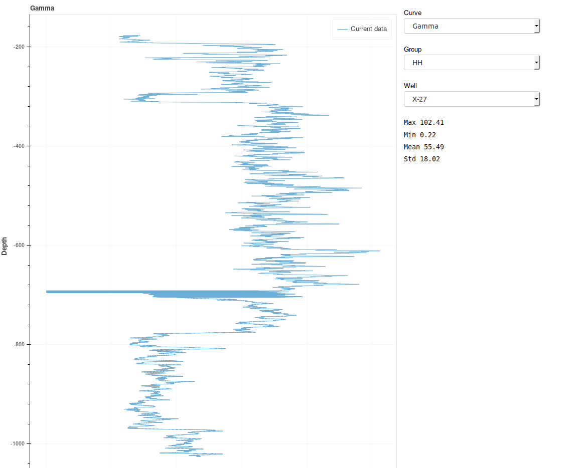

# Depolying an interactive visualization with 
</img>
The [main notebook](./bokeh.ipynb) provides a tutorial for creating a [bokeh](https://github.com/bokeh/bokeh) visualization ready to be deployed as a web app. 
Based on a [prototype tool](https://github.com/laurafroelich/swung_viz_log)  developed during the [2018 Subsurface Hackathon](https://agilescientific.com/events/subsurface2018).
